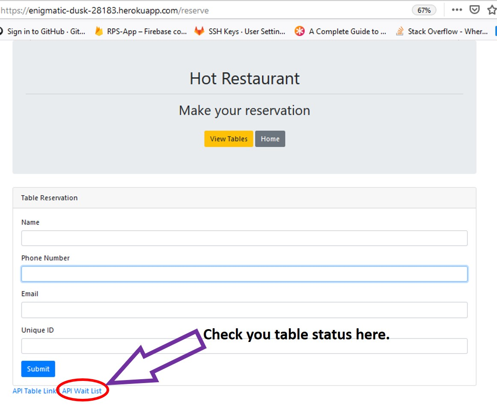

# Hot-Restaurant

This is a basic app demonstrating Node and Express with jQuery. This app schedules reservations requests. My restaurant has just 5 tables available. First five requests get a reservation, every request after that is sent to the waiting list.

Check out the app.
https://enigmatic-dusk-28183.herokuapp.com/

## Instructions:
1. Click on "Make Reservation".
2. Fill in the information required.
3. Click "Submit". 

And just like that, your table is booked.
 * Click on "View Table" to check what table are you in.

Remember that there is limited occupancy. If you didn't get a table don't worry, You'll be in the wating list for the next table available.

You can check you table status by clicking on the link at the bottom of the page named "API Wait List"

Enjoy this app.
